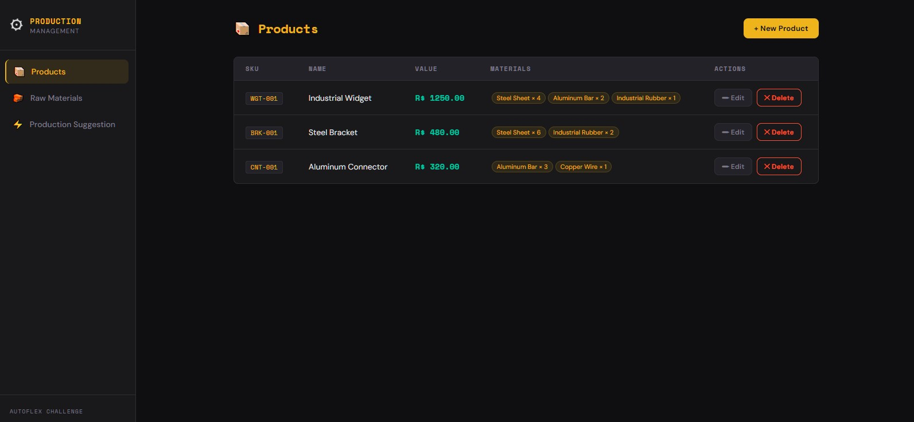
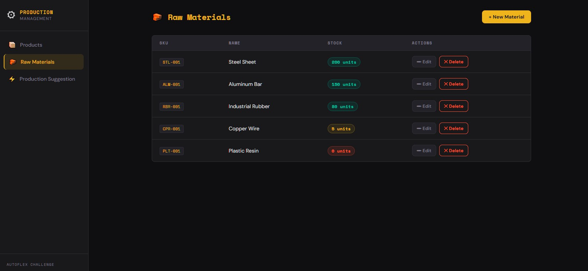
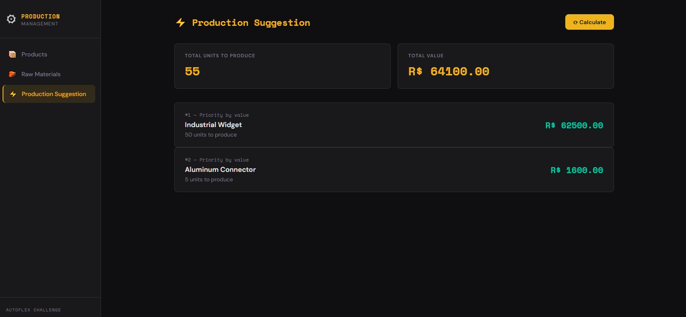
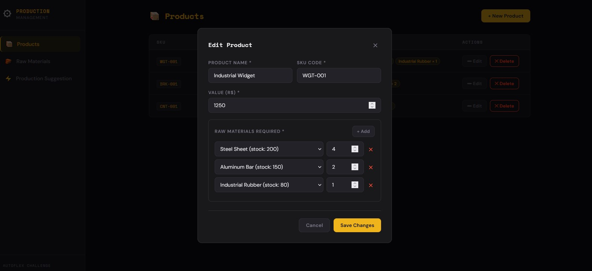
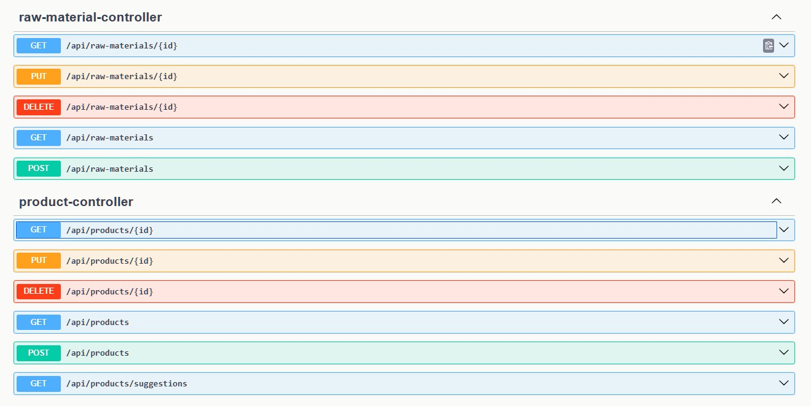

# 🏭 Sistema de Gerenciamento de Produção — Desafio Autoflex

Sistema full-stack para controle de estoque de matérias-primas e sugestão de produção com base na disponibilidade em estoque.

## ⚠️ Status e Manutenção
> **Projeto Descontinuado.** Os links de demonstração (Vercel/Render) foram desativados. O repositório permanece ativo para fins de portfólio e consulta de arquitetura.


---

## 🧠 Considerações de Desenvolvimento
Este projeto foi executado sob uma restrição de tempo reduzida, conciliando o desenvolvimento com jornada de trabalho integral e reta final de graduação. 

**Decisões Estratégicas:**
* **Priorização de Backend:** Foco total na integridade dos dados e na precisão do algoritmo de sugestão.
* **Arquitetura Desacoplada:** Uso de DTOs e camadas de serviço isoladas para facilitar a testabilidade (JUnit/Mockito).
* **Documentação Viva:** Implementação do Swagger para garantir que a API fosse consumível desde o primeiro dia de desenvolvimento.

**Próximos Passos (Backlog):**
- [ ] Implementação de autenticação JWT.
- [ ] Refinamento da UI/UX com bibliotecas de componentes (Tailwind/MUI).
- [ ] Logs estruturados para monitoramento de erros em produção.

---

## 🔗 Acesso ao Sistema

| Serviço | URL |
|---|---|
| **Frontend** | [https://front-end-autoflex.vercel.app](https://front-end-autoflex.vercel.app) |
| **Backend API** | [https://autoflex-back-render.onrender.com](https://autoflex-back-render.onrender.com) |
| **Swagger UI** | [https://autoflex-back-render.onrender.com/swagger-ui/index.html](https://autoflex-back-render.onrender.com/swagger-ui/index.html) |

> ⚠️ O backend está hospedado no plano gratuito do Render. Se a primeira requisição demorar cerca de 50 segundos, o servidor está acordando da hibernação. As requisições seguintes serão rápidas.

---

## 🧩 Tecnologias Utilizadas

| Camada | Tecnologia                          |
|---|-------------------------------------|
| **Frontend** | React 18, Redux Toolkit, Vite       |
| **Backend** | Spring Boot 3, Java 17, Maven       |
| **Banco de Dados** | Oracle Autonomous Database          |
| **ORM** | Spring Data JPA / Hibernate         |
| **Validação** | Jakarta Bean Validation             |
| **Documentação** | SpringDoc OpenAPI (Swagger)         |
| **Testes unitários** | JUnit 5, Mockito, AssertJ           |
| **Testes E2E** | Cypress                             |
| **Deploy** | Vercel (frontend), Render (backend) |

---


### 💻 System Overview
Abaixo, as principais telas da aplicação demonstrando o fluxo de gerenciamento e o algoritmo de sugestão.

<div align="center">
  <table>
    <tr>
      <td width="50%">
        <p align="center"><b>Products Screent</b></p>
        
      </td>
      <td width="50%">
        <p align="center"><b>Raw Materials Screen</b></p>
        
      </td>
    </tr>
    <tr>
      <td width="50%">
        <p align="center"><b>Production Suggestions (Greedy Algo)</b></p>
        
      </td>
      <td width="50%">
        <p align="center"><b>Edit Products</b></p>
        
      </td>
    </tr>
  </table>
</div>

### 🛠️ Technical Documentation (API & Tests)
<details>
  <summary><b>Click to expand Swagger API Documentation</b></summary>
  <p align="center">
    
  </p>
</details>

## 📁 Estrutura do Repositório

```
autoflex-test/
├── back-end/                          # API Spring Boot
│   └── src/
│       ├── main/java/.../
│       │   ├── controller/            # Controllers REST
│       │   ├── service/               # Regras de negócio
│       │   ├── repository/            # Repositórios JPA
│       │   ├── entity/                # Entidades JPA
│       │   ├── dto/                   # DTOs de requisição e resposta
│       │   └── exceptions/            # Handler global de exceções
│       ├── main/resources/
│       │   └── application.properties.example
│       └── test/java/.../
│           ├── service/               # Testes unitários (camada de serviço)
│           └── controller/            # Testes unitários (camada de controller)
└── front-end/                         # Aplicação React
    ├── src/
    │   ├── pages/                     # ProductsPage, RawMaterialsPage, SuggestionsPage
    │   ├── components/                # Toast, ConfirmModal
    │   ├── store/                     # Redux slices
    │   └── services/                  # Serviço de API (fetch)
    ├── cypress/
    │   ├── e2e/                       # Testes end-to-end
    │   └── support/                   # Comandos customizados
    ├── cypress.config.js
    └── .env.example
```

---

## ✅ Requisitos Atendidos

### Não Funcionais
- [x] Plataforma Web — compatível com Chrome, Firefox e Edge
- [x] API REST separando backend do frontend
- [x] Design responsivo
- [x] Banco de dados Oracle
- [x] Framework Spring Boot
- [x] React + Redux
- [x] Nomenclatura em inglês (código, tabelas e colunas)

### Funcionais
- [x] CRUD de Produtos (backend)
- [x] CRUD de Matérias-primas (backend)
- [x] Associação Produto ↔ Matéria-prima (backend)
- [x] Algoritmo de sugestão de produção (backend)
- [x] Interface CRUD de Produtos (frontend)
- [x] Interface CRUD de Matérias-primas (frontend)
- [x] Associação de materiais dentro do modal de produto (frontend)
- [x] Interface de sugestão de produção (frontend)

### Desejáveis
- [x] Testes unitários — JUnit 5 + Mockito (camadas de serviço e controller)
- [x] Testes E2E — Cypress

---

## 🚀 Rodando Localmente

### Pré-requisitos
- Java 17+
- Maven 3.8+
- Node.js 18+
- Oracle Database (ou Oracle Autonomous com Wallet)

### Backend

```bash
cd back-end

# Copie o arquivo de exemplo e preencha com suas credenciais
cp src/main/resources/application.properties.example src/main/resources/application.properties

# Inicie o servidor
./mvnw spring-boot:run
# API disponível em http://localhost:8080
```

**Variáveis de ambiente necessárias:**

| Variável | Descrição |
|---|---|
| `DB_URL` | URL de conexão JDBC (ex: `jdbc:oracle:thin:@localhost:1521:XE`) |
| `DB_USER` | Usuário do banco de dados |
| `DB_PASS` | Senha do banco de dados |

### Frontend

```bash
cd front-end

# Copie o arquivo de exemplo e preencha com a URL da API
cp .env.example .env

# Instale as dependências e inicie
npm install
npm run dev
# Aplicação disponível em http://localhost:3000
```

**Variáveis de ambiente necessárias:**

| Variável | Descrição | Exemplo |
|---|---|---|
| `VITE_API_URL` | URL base do backend | `http://localhost:8080` |

---

## 🧪 Testes Unitários (Backend)

Os testes unitários **não precisam do banco de dados nem da API rodando**. O Mockito simula todas as dependências de forma isolada.

```bash
cd back-end
./mvnw test
```

### O que é testado:

| Classe | Casos de teste |
|---|---|
| `ProductServiceTest` | createProduct, updateProduct, deleteProduct, getProduct, getAllProducts, getProductSuggestion — 10 casos |
| `RawMaterialServiceTest` | getAllRawMaterials, getRawMaterialById, createRawMaterial, updateRawMaterial, deleteRawMaterial — 9 casos |
| `ProductControllerTest` | Todos os endpoints — status 200, 201, 204, 400, 404 — 7 casos |
| `RawMaterialControllerTest` | Todos os endpoints — status 200, 201, 204, 400, 404 — 7 casos |

---

## 🌲 Testes E2E (Cypress)

Os testes Cypress abrem um navegador real e simulam a interação do usuário com a interface. Por isso **precisam que o frontend e o backend estejam rodando** — seja localmente ou em produção.

### Opção 1 — Rodando contra o ambiente local

> Certifique-se de que o backend está rodando em `http://localhost:8080` e o frontend em `http://localhost:3000` antes de executar.

```bash
cd front-end
npm install

# Modo interativo (abre a interface do Cypress — recomendado)
npx cypress open

# Modo headless (roda no terminal sem abrir navegador)
npx cypress run
```

### Opção 2 — Rodando contra o deploy em produção

> Não precisa de nada rodando localmente. Usa diretamente o Vercel e o Render.

```bash
cd front-end
npm install

# Modo headless contra produção
CYPRESS_BASE_URL=https://front-end-autoflex.vercel.app npx cypress run

# Modo interativo contra produção
CYPRESS_BASE_URL=https://front-end-autoflex.vercel.app npx cypress open
```

### O que é testado:

| Arquivo | Cenários |
|---|---|
| `rawMaterials.cy.js` | Carregamento da página, abrir/fechar modal, validação, criar, editar, deletar, cancelar exclusão |
| `products.cy.js` | Carregamento da página, abrir/fechar modal, validação, criar com materiais, editar, deletar, cancelar exclusão |
| `suggestions.cy.js` | Carregamento da página, botão calcular, exibição de resultados, valor total |

---

## 📐 Algoritmo de Sugestão de Produção

O algoritmo utiliza uma **abordagem gulosa (greedy)** priorizando os produtos de maior valor:

1. Busca todos os produtos ordenados por `valor` de forma decrescente
2. Para cada produto, calcula a quantidade máxima produzível com o estoque disponível
3. Consome o estoque proporcionalmente
4. Retorna a lista de produtos que podem ser produzidos com as quantidades e subtotais

Isso garante a maior receita possível com as matérias-primas disponíveis.

---

## 🔌 Endpoints da API

### Produtos
| Método | Endpoint | Descrição |
|---|---|---|
| GET | `/api/products` | Listar todos os produtos |
| GET | `/api/products/{id}` | Buscar produto por ID |
| POST | `/api/products` | Criar produto |
| PUT | `/api/products/{id}` | Atualizar produto |
| DELETE | `/api/products/{id}` | Deletar produto |
| GET | `/api/products/suggestions` | Obter sugestão de produção |

### Matérias-primas
| Método | Endpoint | Descrição |
|---|---|---|
| GET | `/api/raw-materials` | Listar todas as matérias-primas |
| GET | `/api/raw-materials/{id}` | Buscar matéria-prima por ID |
| POST | `/api/raw-materials` | Criar matéria-prima |
| PUT | `/api/raw-materials/{id}` | Atualizar matéria-prima |
| DELETE | `/api/raw-materials/{id}` | Deletar matéria-prima |

Documentação interativa completa disponível no [Swagger UI](https://autoflex-back-render.onrender.com/swagger-ui/index.html).
